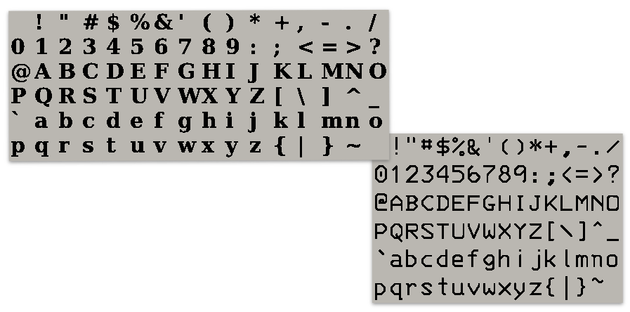

# Fontsheet for Playdate

Generate Playdate compatible font files (.fnt) from your imported **Font Book** files.

Use as the basis for creating your own unique custom PlayDate fonts.



Because **fontsheet** is converting smooth high resolution vector fonts into low res monochrome bitmaps some fettling[^1] with a tool like **Caps** (https://play.date/caps/) will be required to tune the font files to best meet your needs.


## Usage

**fontsheet**

The core parameters
```
./fontsheet ./sample/glyphs.txt -o ./fontFolder -f  MyTTFFont -s 20 -n MyPlaydateFont

```

|  |   |
|:---:|:---|
|  glyphs.txt |This is a file containing a single glyph per line. It feeds **fontsheet** the glyphs symbols to be included in the generated font file. ```space``` is a special keyword in indicate the glyph for… a space.|
| ```--output``` *or* ```-o```  &nbsp; &nbsp; &nbsp; &nbsp; &nbsp; &nbsp; &nbsp; | The folder to save the new Playdate font files
| ```--font``` *or* ```-f``` | The name of a font to convert that is installed in the Font Book app. The *Postscript Name* in the **Font Book** information panel is usally the best choice for the name value.
| ```--size``` *or* ```-s``` | The point size to render.
| ```--name``` *or* ```-n```  | The save name for the font.

Including the ```--embedded``` flag will create a self contained .fnt file that includes font pixel data embedded inside the file. A sample-*.png file is created as a visual reference but can be deleted without affecting the .fnt file.

For more options read ```./fontsheet --help```


## Requirements
- MacOS 14+
- Swift 5

## Install

From the Mac Terminal app.

### The easy way
This will install a sample font and then convert it to a .fnt file to demonstrate how the tool works.

```
cd ~/Developer

git clone git@github.com:ChrisFromHexx/PlayDateFontSheet.git

cd ./PlaydateFontsheet

./scripts/installSampleFont.sh

./scripts/setupFontSheet.sh

```

### The safe way
This will build the tool.
```
cd ~/Developer

git clone git@github.com:ChrisFromHexx/PlayDateFontSheet.git

cd ./PlaydateFontsheet

swift build -c release

cp .build/release/fontsheet .

./fontsheet --help

```

## License
The source code of **Fontsheet** for Playdate is licensed under the MIT license. The license for the Bitstream Vera font is found with the font files. *Playdate* is a registered trademark of [Panic](https://panic.com/).

[^1]: Fettling; to trim or clean rough edges
